poolobject
==========

 

Java code example of creational design pattern pool object

Workshop to use good practices in software developmemnt: testing and measurement.

Authors:

- Carlos Lopez Nozal
- Jesus Alonso Abad

 
 

____

# **INFORME**

## Alumnos

- Mario Hurtado Ubierna (mhu1001@alu.ubu.es)
- Gadea Lucas Pérez (glp1002@alu.ubu.es)

 

## **Tabla de contenido** 

- [**INFORME**](#informe)
  - [Alumnos](#alumnos)
  - [Tabla de contenido](#tabla-de-contenido)
  - [Enunciado](#enunciado)
  - [Descripción del producto](#descripción-del-producto)
    - [Creación del _fork_](#creación-del-fork)
    - [Vinculación a Codecov](#vinculación-a-codecov)
    - [Prueba de Codecov](#prueba-de-codecov)
    - [Informe de Codecov](#informe-de-codecov)
    - [README links](#readme-links)
    - [Tests JUnit](#tests-junit)
        - [Test 1: GetInstance](#test-1-getinstance)
        - [Test 2: AcquireReusable](#test-2-acquirereusable)
        - [Test 3: ReleaseReusable](#test-3-releasereusable)
        - [Pruebas superadas](#pruebas-superadas)
- [Preguntas](#preguntas)

 

## **Enunciado**
En la práctica se va simular un pequeño desarrollo de un producto software para realizar mediciones sobre él. El objetivo es establecer un caso de estudio que sirva para caracterizar y evaluar tanto el producto desarrollado como el proceso seguido.

 

## **Descripción del producto**
Dado un código de ejemplo del patrón diseño creacional Pool Object, se debe crear una batería de pruebas tal
que las coberturas de sus clases sean del 100%. El código de las clases se puede obtener en el repositorio
https://github.com/clopezno/poolobject. La batería de pruebas JUnit debe estar contenida en la clase `ubu.gii.dass.test.c01.ReuseblePoolTest.java`.

 

##  **Descripción del proceso**
A continuación, detallaremos los pasos del proceso para probar la cobertura de código utilizando Codecov.io.

### **Creación del _fork_:**
El proceso comienza con cada miembro del equipo registrándose en GitHub y Codecov.io. Luego, uno de los miembros del equipo, realiza un fork del repositorio donde se encuentra el código que se quiere probar y lo configura como público.

### **Vinculación a Codecov:**
A continuación, se vincula el proyecto con Codecov.io para poder realizar un seguimiento de la cobertura del código. Para ello, uno de los alumnos se registra en la página oficial de Codecov.io y sigue los pasos indicados en ella para vincular el proyecto de GitHub.

 

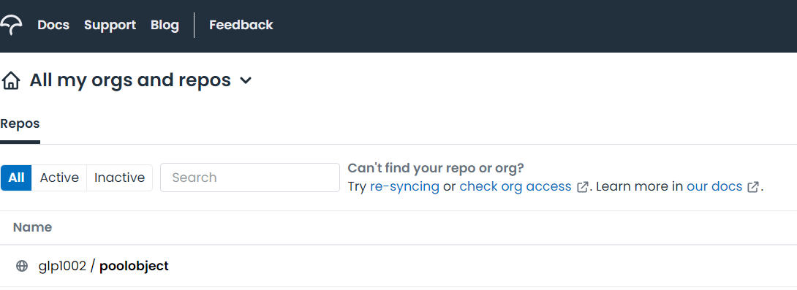
Figura 1: Conexión con Codecov

 

Durante el proceso de vinculación, Codecov.io solicita la creación de un `secreto`. Este secreto es una cadena de caracteres que se utiliza para autenticar la conexión entre el repositorio de GitHub y Codecov.io. El secreto se configura en la sección de ajustes del repositorio de GitHub y se utiliza para cifrar los informes de cobertura antes de ser enviados a Codecov.io para su análisis. De esta forma, se garantiza que los informes de cobertura estén protegidos y seguros durante su transferencia.

 

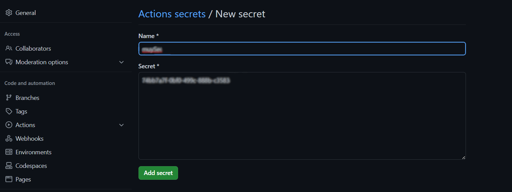
Figura 2: Creación del secreto

 

Para comprobar que el proyecto de GitHub se ha vinculado correctamente con Codecov, los alumnos necesitan verificar que los informes de cobertura se envían correctamente a Codecov.io. Dado que aún no se han programado los tests para el proyecto, los _workflows_ fallarían si se intentara ejecutarlos. Para evitar este problema, los alumnos han decidido cambiar temporalmente la variable `haltonfailure` del archivo `build.xml` a ***false*** como se ha recomendado en clase. Esto permite que los _workflows_ se ejecuten sin que el proyecto falle debido a la falta de _tests_. Una vez que se hayan programado las pruebas, la variable `haltonfailure` se establecerá nuevamente en ***true***.

 

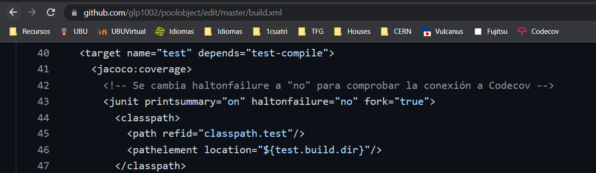
Figura 3: Cambio de "haltonfailure"

 

### **Prueba de Codecov:**
A continuación, uno de los alumnos hace un _commit_ solamente para verificar que el _workflow_ se ejecuta sin problemas. Una vez que se ha realizado el _commit_, se puede observar que el icono correspondiente al _workflow_ muestra un _tick_ verde, lo que indica que el proceso se ha ejecutado correctamente. Esto demuestra que el proyecto se ha vinculado correctamente con Codecov y que la información de cobertura se está enviando correctamente a la plataforma. Con este paso, los alumnos puede continuar desarrollando y probando el proyecto con la seguridad de que se está realizando un seguimiento detallado de la cobertura del código.

 

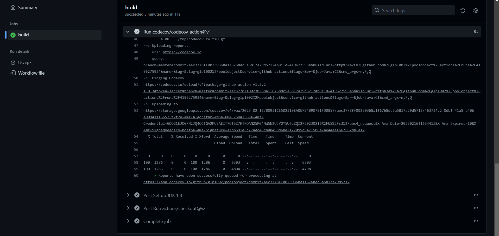
Figura 4: Comprobación tras hacer un _commit_

 

### **Informe de Codecov:**
El informe de cobertura también se puede ver en la página web de Codecov.io (https://app.codecov.io/gh/glp1002/poolobject). Allí, se pueden observar los porcentajes de cobertura de las diferentes secciones del proyecto, así como las líneas de código que no han sido cubiertas aún. Esto es útil para identificar rápidamente las áreas del código que necesitan ser probadas con mayor detalle.

Es importante observar que los informes de Codecov se representan en tres colores diferentes: verde, amarillo y rojo. El color verde indica que la sección correspondiente del código está completamente cubierta por las pruebas. El color amarillo indica que la sección tiene cierta cobertura de pruebas, pero no está completamente cubierta. Finalmente, el color rojo indica que la sección no tiene cobertura de pruebas en absoluto.

 

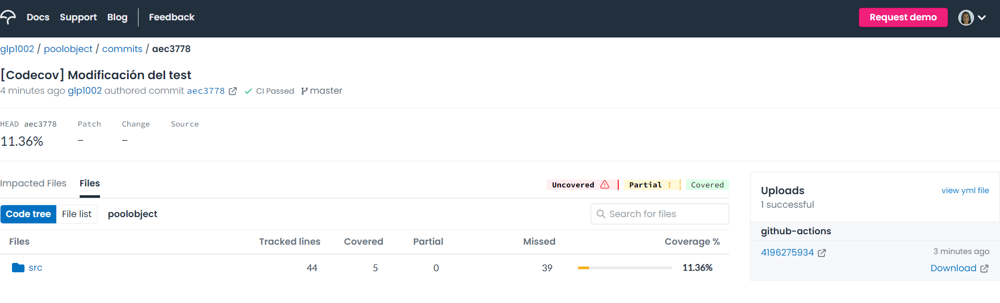
Figura 5: Informe inicial de Codecov

 

### **README links:**
Inicialmente, después de hacer el _fork_ del repositorio, se descubrió que los enlaces en el archivo README.md para los _workflows_ de Codecov no estaban actualizados. Por lo tanto, se procede a actualizar estos enlaces para poder ver la cobertura del código.

Además, se recuerda que debido a que la variable `haltonfailure` que se cambió temporalmente a ***false***, el informe de cobertura puede indicar que las pruebas han pasado correctamente. Sin embargo, es importante tener en cuenta que esta información es engañosa y no refleja la realidad, ya que no se han implementado pruebas significativas todavía.

 

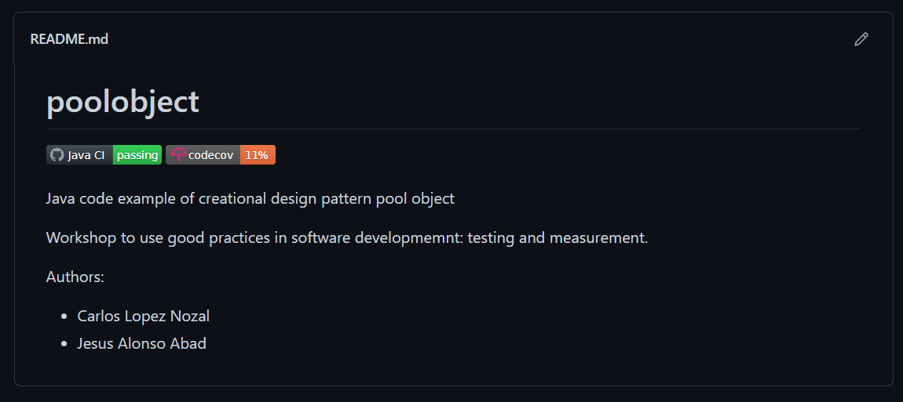
Figura 6: Links de los _workflows_actualizados

 

### **Tests JUnit**
Finalmente, se procede a programar el código para las pruebas de la clase `ReusablePool`.
El objetivo es tener la mayor cantidad posible de secciones cubiertas por pruebas y minimizar el número de secciones sin cobertura. Utilizando el informe de cobertura de Codecov, los alumnos pueden enfocar sus esfuerzos en mejorar la calidad de las pruebas y aumentar la cobertura del código en las áreas que lo necesitan.

 

#### **Test 1: GetInstance**
En este test se verifica que el sistema es capaz de obtener una instancia de `ReusablePool` y que esta instancia, siguiendo el patrón de diseño "Singleton", debe ser única y tener un único punto de acceso a través del método `getInstance()`. De esta forma, se garantiza que solo se cree una instancia de la clase y se pueda acceder a ella desde cualquier parte del sistema. Se considera que este es un paso importante para garantizar la eficiencia y la coherencia del sistema en su conjunto.

 Los cambios necesarios se pueden apreciar en la siguiente captura de ReusablePoolTest.java.

 

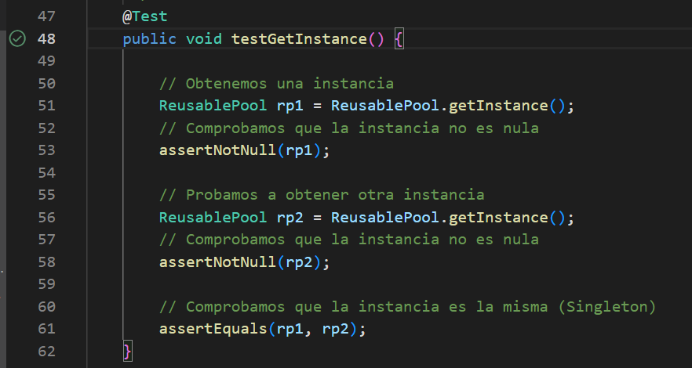
Figura 7: Código del test 1 pasado

 

Se adjunta también la cobertura del método según el informe de Codecov.

 

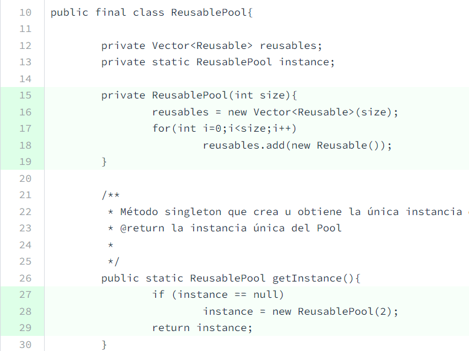
Figura 8: Informe Codecov cubierto

 

#### **Test 2: AcquireReusable**

En este test se comprueba que el sistema es capaz de obtener los objetos `Reusable` que se encuentran dentro del Vector de la instancia de `ReusablePool`. Asimismo, se verifica que el método adquiere los objetos `Reusable` correctamente y que lanza la excepción `NotFreeInstanceException` cuando el Vector de objetos se encuentra vacío. Es preciso recordar que, la primera vez que se crea una instancia de `ReusablePool`, el Vector se inicializa por defecto con **dos** objetos `Reusable` (tamaño dos). 

Los cambios necesarios se pueden apreciar en la siguiente captura de ReusablePoolTest.java.

 

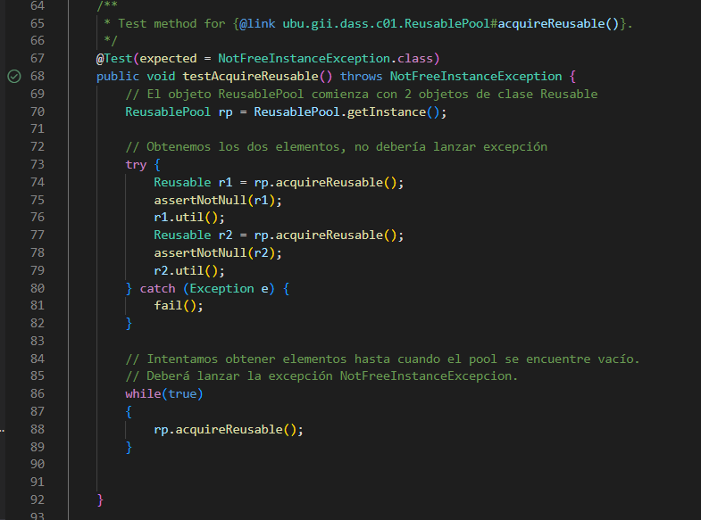
Figura 9: Código del test 2 pasado

 

Se adjunta también la cobertura del método según el informe de Codecov.

 

Figura 10: Informe Codecov cubierto

[TO DO: imagen]

 

#### **Test 3: ReleaseReusable**

Este test se encarga de comprobar que el método `ReleaseReusable` libera los objetos `Reusable` y los añade de vuelta al `ReusablePool`. Además, se verifica que el método lanza la excepción `NotFreeInstanceException` cuando se intenta liberar un objeto que ya se encuentra en el `ReusablePool`.

Los cambios necesarios se pueden apreciar en la siguiente captura de ReusablePoolTest.java.

 

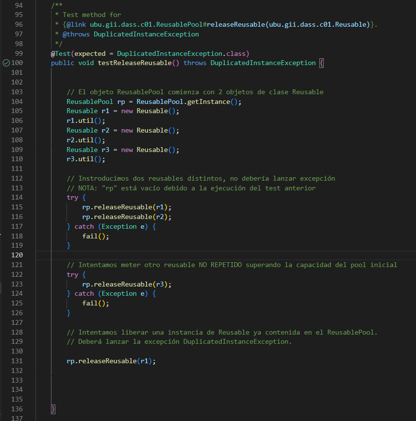
Figura 11: Código del test 3 pasado

 

Se adjunta también la cobertura del método según el informe de Codecov.

 

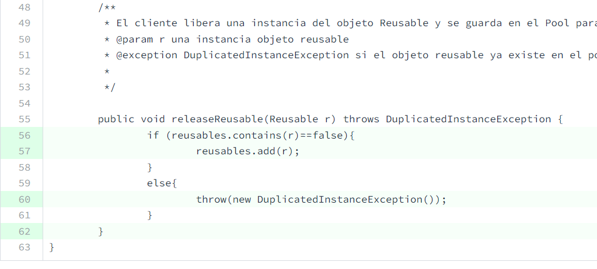
Figura 12: Informe Codecov cubierto

 

#### **Pruebas superadas**

Finalmente, todas las pruebas realizadas en el proyecto han sido exitosas y se ha conseguido una cobertura del 100% en el código de  `ReusablePool`. Se ha demostrado que el sistema es capaz de obtener instancias de `ReusablePool`, adquirir y liberar objetos `Reusable` correctamente, y se han comprobado las excepciones en los casos en que el _pool_ no contiene objetos disponibles.

 

Figura 13: Ejecución de pruebas superadas

 

Además, se adjunta también la prueba del recubrimiento de Codecov.

 

Figura 14: Ejecución de pruebas superadas en Codecov

 

[TO DO: imagen]

Es importante señalar que una vez comprobado que los _workflows_ se ejecutan correctamente, se ha vuelto a establecer la variable `haltonfailure` a ***true***, de forma que si en el futuro se introducen cambios que incumplen las pruebas, el flujo de trabajo no pasará y se indicará el fallo correspondiente. 

 

Figura 15: Pruebas superadas

 
 

## **Preguntas**
A continuación se tratará de dar respuesta a las siguientes preguntas:

1. **¿Se ha realizado trabajo en equipo?** 
Sí, se ha trabajado en equipo. Ambas personas han colaborado y compartido ideas en la realización del proyecto. Aunque se destaca que dos de los _tests_ se han realizado de manera individual por cada miembro del equipo.

2. **¿Tiene calidad el conjunto de pruebas disponibles?** 
Sí, el conjunto de pruebas disponibles tiene calidad. Se ha realizado una cobertura completa del código, intentando incluir casos límite y situaciones especiales.Es preciso tener en cuenta que los atributos de ReusablePool son privados y no tienen un método público para acceder a ellos y comprobar sus valores. A pesar de esta limitación, se intentado realizar pruebas exhaustivas que aseguran que el comportamiento del código es correcto en todas las situaciones posibles.

3. **¿Cuál es el esfuerzo invertido en realizar la actividad?** 
El esfuerzo invertido en realizar la actividad no ha sido muy alto, ya que la dificultad de la práctica no era muy elevada. En cuanto a la parte más complicada de la práctica, se podría destacar la conexión del proyecto a Codecov, puesto que era la primera vez que se trabajaba con esta herramienta. Sin embargo, gracias a la documentación proporcionada y la ayuda de los tutoriales, se pudo realizar la integración sin mayores inconvenientes.

4. **¿Cuál es el número de fallos encontrados en el código?** 
[TO DO: terminar]
A lo largo de la presente práctica, no ha surgido una dificultad en el segundo _test_. A pesar de comprobar que la excepción se lanza en los momentos adecuados, el informe de Codecov continuaba indicando lo contrario. También indicaba que no se había comprobado el tamaño del _pool_ cuando, en realidad, se trata de un atributo privado al que no tenemos acceso en el _test_.

Figura 16: Errores en el segundo test

