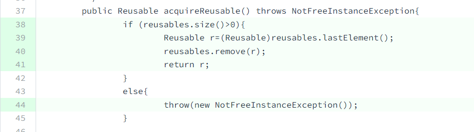
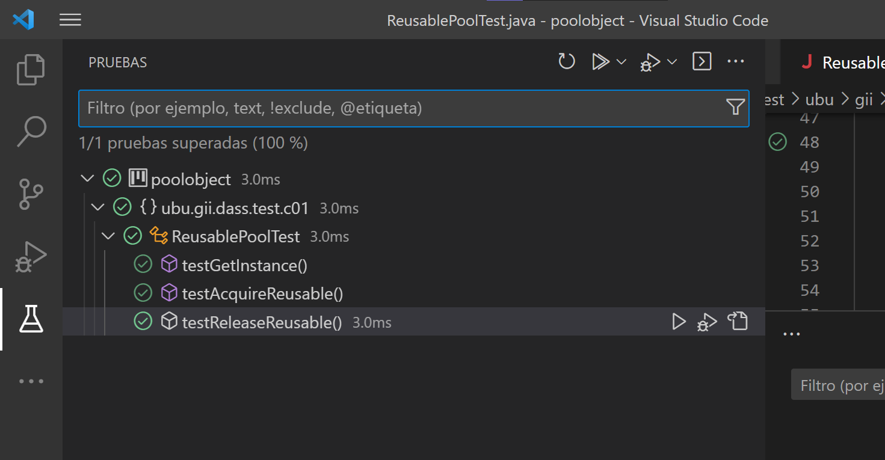
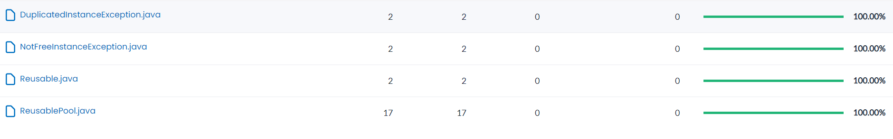
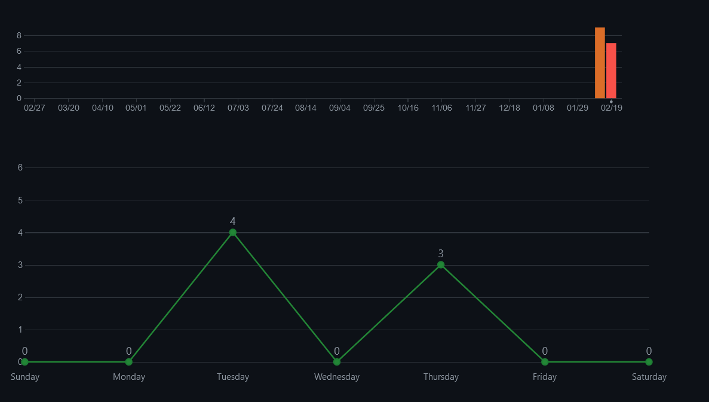
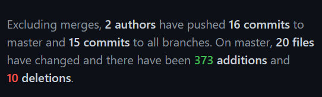
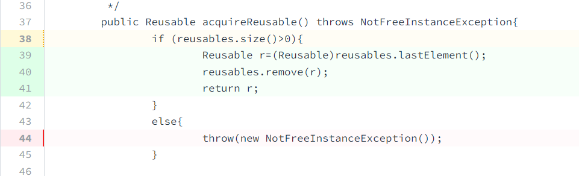

poolobject
==========

[](https://github.com/glp1002/poolobject/actions/workflows/ci.yml) [](https://codecov.io/gh/glp1002/poolobject)

Java code example of creational design pattern pool object

Workshop to use good practices in software developmemnt: testing and measurement.

Authors:

- Carlos Lopez Nozal
- Jesus Alonso Abad

<br/>
<br/>

____

# **INFORME**

## Alumnos

- Mario Hurtado Ubierna (mhu1001@alu.ubu.es)
- Gadea Lucas Pérez (glp1002@alu.ubu.es)

<br/>

## **Tabla de contenido** 

- [poolobject](#poolobject)
- [**INFORME**](#informe)
  - [Alumnos](#alumnos)
  - [**Tabla de contenido**](#tabla-de-contenido)
  - [**Enunciado**](#enunciado)
  - [**Descripción del producto**](#descripción-del-producto)
  - [**Descripción del proceso**](#descripción-del-proceso)
    - [**Creación del _fork_:**](#creación-del-fork)
    - [**Vinculación a Codecov:**](#vinculación-a-codecov)
    - [**Prueba de Codecov:**](#prueba-de-codecov)
    - [**Informe de Codecov:**](#informe-de-codecov)
    - [**README links:**](#readme-links)
    - [**Tests JUnit**](#tests-junit)
      - [**Test 1: GetInstance**](#test-1-getinstance)
      - [**Test 2: AcquireReusable**](#test-2-acquirereusable)
      - [**Test 3: ReleaseReusable**](#test-3-releasereusable)
      - [**Pruebas superadas**](#pruebas-superadas)
  - [**Preguntas**](#preguntas)
      - [**1. ¿Se ha realizado trabajo en equipo?**](#1-se-ha-realizado-trabajo-en-equipo)
      - [**2. ¿Tiene calidad el conjunto de pruebas disponibles?**](#2-tiene-calidad-el-conjunto-de-pruebas-disponibles)
      - [**3. ¿Cuál es el esfuerzo invertido en realizar la actividad?**](#3-cuál-es-el-esfuerzo-invertido-en-realizar-la-actividad)
      - [**4. ¿Cuál es el número de fallos encontrados en el código?**](#4-cuál-es-el-número-de-fallos-encontrados-en-el-código)
  - [**Aspectos relevantes**](#aspectos-relevantes)
  - [**BIBLIOGRAFÍA**](#bibliografía)

<br/>

## **Enunciado**
En la práctica se va simular un pequeño desarrollo de un producto software para realizar mediciones sobre él. El objetivo es establecer un caso de estudio que sirva para caracterizar y evaluar tanto el producto desarrollado como el proceso seguido.

<br/>

## **Descripción del producto**
Dado un código de ejemplo del patrón de diseño creacional Singleton aplicado a un Pool de objetos llamado Pool Object, se debe crear una batería de pruebas tal
que las coberturas de sus clases sean del 100%. El código de las clases se puede obtener en el repositorio
https://github.com/clopezno/poolobject. La batería de pruebas JUnit debe estar contenida en la clase `ubu.gii.dass.test.c01.ReusablePoolTest.java`.

<br/>

##  **Descripción del proceso**
A continuación, detallaremos los pasos del proceso para probar la cobertura de código utilizando Codecov.io.

### **Creación del _fork_:**
El proceso comienza con cada miembro del equipo registrándose en GitHub y Codecov.io. Luego, uno de los miembros del equipo, realiza un fork del repositorio donde se encuentra el código que se quiere probar y lo configura como público.

### **Vinculación a Codecov:**
A continuación, se vincula el proyecto con Codecov.io para poder realizar un seguimiento de la cobertura del código. Para ello, uno de los alumnos se registra en la página oficial de Codecov.io y sigue los pasos indicados en ella para vincular el proyecto de GitHub.

<br/>


Figura 1: Conexión con Codecov

<br/>

Durante el proceso de vinculación, Codecov.io solicita la creación de un `secreto`. Este secreto es una cadena de caracteres que se utiliza para autenticar la conexión entre el repositorio de GitHub y Codecov.io. El secreto se configura en la sección de ajustes del repositorio de GitHub y se utiliza para cifrar los informes de cobertura antes de ser enviados a Codecov.io para su análisis. De esta forma, se garantiza que los informes de cobertura estén protegidos y seguros durante su transferencia.

<br/>


Figura 2: Creación del secreto

<br/>

Para comprobar que el proyecto de GitHub se ha vinculado correctamente con Codecov, los alumnos necesitan verificar que los informes de cobertura se envían correctamente a Codecov.io. Dado que aún no se han programado los tests para el proyecto, los _workflows_ fallarían si se intentara ejecutarlos. Para evitar este problema, los alumnos han decidido cambiar temporalmente la variable `haltonfailure` del archivo `build.xml` a ***false*** como se ha recomendado en clase. Esto permite que los _workflows_ se ejecuten sin que el proyecto falle debido a la falta de _tests_. Una vez que se hayan programado las pruebas, la variable `haltonfailure` se establecerá nuevamente en ***true***.

<br/>


Figura 3: Cambio de "haltonfailure"

<br/>

### **Prueba de Codecov:**
A continuación, uno de los alumnos hace un _commit_ solamente para verificar que el _workflow_ se ejecuta sin problemas. Una vez que se ha realizado el _commit_, se puede observar que el icono correspondiente al _workflow_ muestra un _tick_ verde, lo que indica que el proceso se ha ejecutado correctamente. Esto demuestra que el proyecto se ha vinculado correctamente con Codecov y que la información de cobertura se está enviando correctamente a la plataforma. Con este paso, los alumnos puede continuar desarrollando y probando el proyecto con la seguridad de que se está realizando un seguimiento detallado de la cobertura del código.

<br/>


Figura 4: Comprobación tras hacer un _commit_

<br/>

### **Informe de Codecov:**
El informe de cobertura también se puede ver en la página web de Codecov.io (https://app.codecov.io/gh/glp1002/poolobject). Allí, se pueden observar los porcentajes de cobertura de las diferentes secciones del proyecto, así como las líneas de código que no han sido cubiertas aún. Esto es útil para identificar rápidamente las áreas del código que necesitan ser probadas con mayor detalle.

Es importante observar que los informes de Codecov se representan en tres colores diferentes: verde, amarillo y rojo. El color verde indica que la sección correspondiente del código está completamente cubierta por las pruebas. El color amarillo indica que la sección tiene cierta cobertura de pruebas, pero no está completamente cubierta. Finalmente, el color rojo indica que la sección no tiene cobertura de pruebas en absoluto.

<br/>


Figura 5: Informe inicial de Codecov

<br/>

### **README links:**
Inicialmente, después de hacer el _fork_ del repositorio, se descubrió que los enlaces en el archivo README.md para los _workflows_ de Codecov no estaban actualizados. Por lo tanto, se procede a actualizar estos enlaces para poder ver la cobertura del código.

Además, se recuerda que debido a que la variable `haltonfailure` que se cambió temporalmente a ***false***, el informe de cobertura puede indicar que las pruebas han pasado correctamente. Sin embargo, es importante tener en cuenta que esta información es engañosa y no refleja la realidad, ya que no se han implementado pruebas significativas todavía.

<br/>


Figura 6: Links de los _workflows_actualizados

<br/>

### **Tests JUnit**
Finalmente, se procede a programar el código para las pruebas de la clase `ReusablePool`.
El objetivo es tener la mayor cantidad posible de secciones cubiertas por pruebas y minimizar el número de secciones sin cobertura. Utilizando el informe de cobertura de Codecov, los alumnos pueden enfocar sus esfuerzos en mejorar la calidad de las pruebas y aumentar la cobertura del código en las áreas que lo necesitan.

<br/>

#### **Test 1: GetInstance**
En este test se verifica que el sistema es capaz de obtener una instancia de `ReusablePool` y que esta instancia, siguiendo el patrón de diseño "Singleton", debe ser única y tener un único punto de acceso a través del método `getInstance()`. De esta forma, se garantiza que solo se cree una instancia de la clase y se pueda acceder a ella desde cualquier parte del sistema. Se considera que este es un paso importante para garantizar la eficiencia y la coherencia del sistema en su conjunto.

 Los cambios necesarios se pueden apreciar en la siguiente captura de ReusablePoolTest.java.

<br/>


Figura 7: Código del test 1 pasado

<br/>

Se adjunta también la cobertura del método según el informe de Codecov.

<br/>


Figura 8: Informe Codecov cubierto

<br/>

#### **Test 2: AcquireReusable**

En este test se comprueba que el sistema es capaz de obtener los objetos `Reusable` que se encuentran dentro del Vector de la instancia de `ReusablePool`. Asimismo, se verifica que el método adquiere los objetos `Reusable` correctamente y que lanza la excepción `NotFreeInstanceException` cuando el Vector de objetos se encuentra vacío. Es preciso recordar que, la primera vez que se crea una instancia de `ReusablePool`, el Vector se inicializa por defecto con **dos** objetos `Reusable` (tamaño dos). 

Los cambios necesarios se pueden apreciar en la siguiente captura de ReusablePoolTest.java.

<br/>


Figura 9: Código del test 2 pasado

<br/>

Cabe mencionar que, debido a que no conocemos el números de objetos ```Reusable``` que contiene la instancia del _pool_ en un momento determinado (i.e. momento de ejecución del _test_), se ha incluido en el _test_ un bucle `while(true){...}` para vaciar el _pool_ de objetos.

Se adjunta también la cobertura del método según el informe de Codecov.

<br/>


Figura 10: Informe Codecov cubierto

<br/>

#### **Test 3: ReleaseReusable**

Este test se encarga de comprobar que el método `ReleaseReusable` libera los objetos `Reusable` y los añade de vuelta al `ReusablePool`. Además, se verifica que el método lanza la excepción `NotFreeInstanceException` cuando se intenta liberar un objeto que ya se encuentra en el `ReusablePool`.

Los cambios necesarios se pueden apreciar en la siguiente captura de ReusablePoolTest.java.

<br/>


Figura 11: Código del test 3 pasado

<br/>

Se adjunta también la cobertura del método según el informe de Codecov.

<br/>


Figura 12: Informe Codecov cubierto

<br/>

#### **Pruebas superadas**

Finalmente, todas las pruebas realizadas en el proyecto han sido exitosas y se ha conseguido una cobertura del 100% en el código de  `ReusablePool`. Se ha demostrado que el sistema es capaz de obtener instancias de `ReusablePool`, adquirir y liberar objetos `Reusable` correctamente, y se han comprobado las excepciones en los casos en que el _pool_ no contiene objetos disponibles.

<br/>


Figura 13: Ejecución de pruebas superadas

<br/>

Además, se adjunta también la prueba del recubrimiento de Codecov.


<br/>



Figura 14: Pruebas superadas Codecov

Es importante señalar que una vez comprobado que los _workflows_ se ejecutan correctamente, se ha vuelto a establecer la variable `haltonfailure` a ***true***, de forma que si en el futuro se introducen cambios que incumplen las pruebas, el flujo de trabajo no pasará y se indicará el fallo correspondiente. 

<br/>


Figura 15: Pruebas superadas

<br/>
<br/>

## **Preguntas**
A continuación se tratará de dar respuesta a las siguientes preguntas:

<br/>

#### **1. ¿Se ha realizado trabajo en equipo?** 
Sí, se ha trabajado en equipo. Ambas personas han colaborado y compartido ideas en la realización del proyecto. Aunque se destaca que dos de los _tests_ se han realizado de manera individual por cada miembro del equipo.

Así pues, se han realizado un total de 18 _commits_. A continuación, se adjunta una imagen del siguiente [apartado](https://github.com/glp1002/poolobject/graphs/commit-activity) del repositorio en GitHub.

<br/>



Figura 16: Gráficas de commits I

<br/>

---
&nbsp;&nbsp;&nbsp;&nbsp;&nbsp;&nbsp;&nbsp;***Leyenda***
- Gráfica 1: _Commits_ realizados por semana
- Gráfica 2: _Commits_ realizados por día en la última semana (19-26 feb)
---

<br/>

En este mismo repositorio se puede comprobar que ambos integrantes han hecho aportaciones similares al proyecto, incluso se han realizado _commits_ en conjunto.

<br/>

#### **2. ¿Tiene calidad el conjunto de pruebas disponibles?** 
Sí, el conjunto de pruebas disponibles tiene calidad. Se ha realizado una **cobertura** completa del código, intentando incluir casos límite y situaciones especiales. Es preciso tener en cuenta que los atributos de ReusablePool son privados y no tienen un método público para acceder a ellos y comprobar sus valores. A pesar de esta limitación, se intentado realizar pruebas exhaustivas que aseguran que el comportamiento del código es correcto en todas las situaciones posibles.

Codecov es una herramienta que nos permite medir el porcentaje de cobertura del código que se pretende probar (_ver Figura 14_). Puesto que ya se ha mencionado en numerosas ocasiones más arriba, no se desarrollará más al respecto.

Como medida alternativa, se podría emplear como métrica el **número de casos de prueba** frente al conjunto real de métodos de prueba programados. 

Otra medida importante que garantiza la calidad de las pruebas es el **número de fallos** en el código original que son capaces de detectar. Este aspecto se detallará en la [4ª pregunta](#4.-¿cuál-es-el-número-de-fallos-encontrados-en-el-código?).

<br/>

#### **3. ¿Cuál es el esfuerzo invertido en realizar la actividad?** 
El esfuerzo invertido en realizar la actividad no ha sido muy alto, ya que la dificultad de la práctica no era muy elevada. En cuanto a la parte más complicada de la práctica, se podría destacar la conexión del proyecto a Codecov, puesto que era la primera vez que se trabajaba con esta herramienta. Sin embargo, gracias a la documentación proporcionada y la ayuda de los tutoriales, se pudo realizar la integración sin mayores inconvenientes.

Como atributo de medición de la calidad, se ha decidido emplear el ***commit*** y, como unidad de medida, las **líneas modificadas** en cada _commit_. Partiendo de esta premisa, es posible calcular el total de líneas de código modificadas a lo largo de la práctica. A continuación, se adjuntan las métricas que proporciona GitHub al respecto.

<br/>



Figura 17: Gráficas de commits II

<br/>

Sobre esta imagen, es preciso puntualizar que, aunque las líneas de código pueden parecer una buena métrica _a priori_, no todas las líneas que se modifican suponen la misma cantidad de esfuerzo. Por ejemplo, muchas de ellas pertenecen a los cambios realizados en el presente informe, mientras que otras pertenecen a la realización de los _tests_ de JUnit. Evidentemente, estas últimas tienen mayor carga de trabajo. 

Una alternativa que proponen los alumnos a esta medida es el empleo de la **estimación de poquer** de las historias de usuario generadas para el proyecto y determinadas por el equipo en conjunto. Esta métrica es mucho más confiable que las anteriores.

<br/>

#### **4. ¿Cuál es el número de fallos encontrados en el código?** 
En el proceso de realización de las pruebas, se han detectado posibles errores, que no se han adjuntado puesto que no son parte de los métodos propuestos para esta entrega. Entre ellos, se proponen los siguientes:

**Atributos privados**
Los atributos de una clase que sigue el patrón Singleton deberían ser privados para evitar modificaciones en los mismos. Sin embargo, nada impide la implementación de métodos públicos ***get***, de forma que, si fuera necesario, se podría consultar dichos atributos.
Por ejemplo, el atributo _size_ del Vector del _pool_ es muy útil para saber el número de objetos ```Reusable``` que contiene en un determinado momento. Para ello, se diseñaría un método de pruebas similar al siguiente:

```java
/* NOTA: No deberá de existir instancia previa de ReusablePool creándose una nueva mediante el constructor
*/
@Test
public void testGetSize(){
  //Instancia de ReusablePool
  ReusablePool rp = ReusablePool.getInstance();
  int size1 = rp.getSize();
  // Inicialmente el pool se crea con dos instancias
  assertEquals(size1,2);
  // Extraemos Reusable
  Reusable r = rp.AcquireReusable();
  int size2 = rp.getSize();
  assertEquals(size2,1);
  // Introducimos Reusable
  rp.ReleaseReusable(r);
  int size3 = rp.getSize();
  assertEquals(size3,3);
}
```

Si se ejecuta este _test_, el código no pasará las pruebas puesto que no tiene un método público _get_ implementado.


**Eliminar instancia**
El patrón Singleton

```java
@Test
public void testRemoveIstance(){
  //Instancia de ReusablePool
  ReusablePool rp = ReusablePool.getInstance();

}
```


<br/>
<br/>

## **Aspectos relevantes**
A lo largo de la presente práctica, nos ha surgido una dificultad en el segundo _test_. A pesar de comprobar que la excepción se lanza en los momentos adecuados, el informe de Codecov continuaba indicando lo contrario. También indicaba que no se había comprobado el tamaño del _pool_ cuando, en realidad, se trata de un atributo privado al que no tenemos acceso en el _test_.



Figura 18: Errores en el segundo test

Para poder solucionar este problema (_commit_ 20bfdb8), se ha recurrido al atributo "expected" de la anotación @Test para declarar que esperamos que se lance una excepción en cualquier lugar del método de prueba anotado. Como resultado, cuando se ejecuta la prueba, esta fallará si la excepción especificada no es lanzada y pasará si es lanzada [1].


Figura 19: Errores en el segundo test solucionados

Asimismo, se ha cambiado el método de prueba del tercer test con el fin de homogeneizar las técnicas de prueba.
De esta forma, el porcentaje de cobertura de Codecov ha aumentado en un 10%.


Figura 20: Aumento de la cobertura en Codecov


<br/>
<br/>

___
---

<br/>
<br/>

## **BIBLIOGRAFÍA**

- [1] title: "Assert an Exception is Thrown in JUnit 4 and 5."
&nbsp;&nbsp;&nbsp;&nbsp;<br> author: "Baeldung"
&nbsp;&nbsp;&nbsp;&nbsp;<br> date: "2018, April 13"
&nbsp;&nbsp;&nbsp;&nbsp;<br> link: https://www.baeldung.com/junit-assert-exception 


